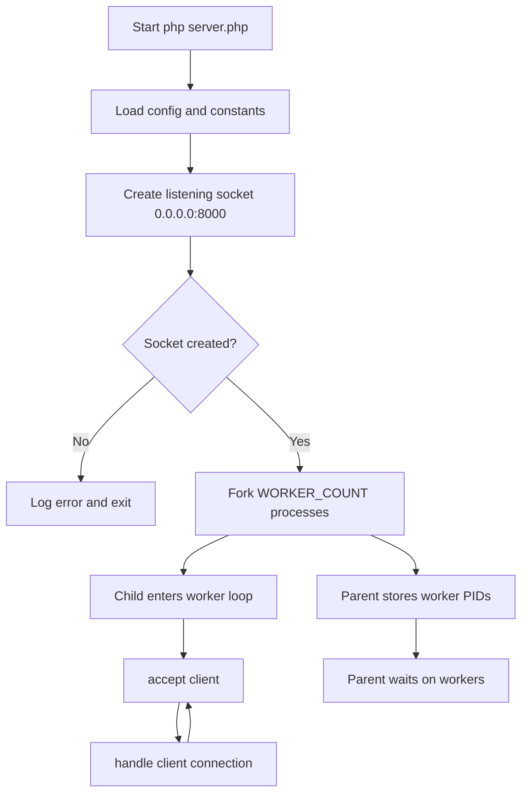
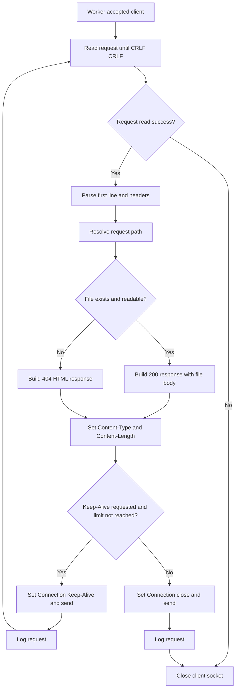

# Joojoo Architecture

This document describes how the project works today.

## 1) Server Startup And Running

This chart shows what happens when you start `php server.php`.

## 2) Request Processing (Assuming Server Is Already Running)

This chart starts at the moment a worker accepts a client connection.

## Main Request Path

1. The main process binds to `0.0.0.0:8000`.
2. It forks multiple workers (`WORKER_COUNT = cores x 2`).
3. Each worker accepts a client and reads until `\r\n\r\n`.
4. The server parses headers and request target path.
5. If file exists, it returns `200 OK`; otherwise a built-in `404 Not Found` page.
6. Response includes `Content-Type`, `Content-Length`, and connection headers.
7. Keep-Alive loop continues until timeout or max requests.

## Process Model

- One listening socket is created before forking.
- Worker children share the listening socket and compete on `socket_accept`.
- Parent process waits for worker PIDs.
